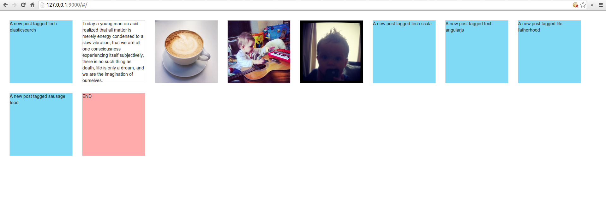
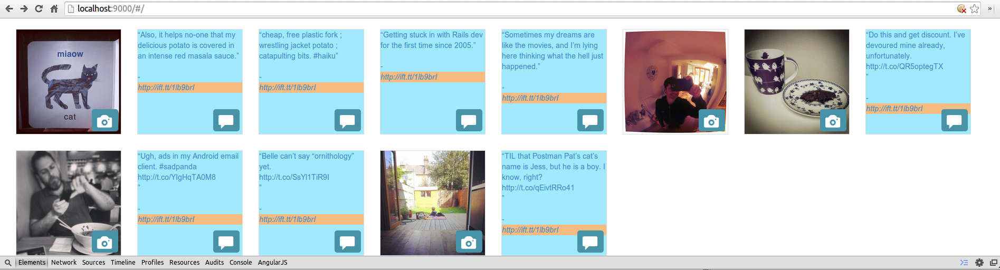

Looky
=====

A few days ago.
---------------

Recently.
---------

Random notes...
=========

...about what this is, and potentially could be.

Almost like "RSS visualised", but using ElasticSearch and AngularJS.

Our digital lives are scattered all over the place, in disparate silos. You also don't own those silos.

Activity -> IFTTT/Huginn -> Post to ElasticSearch instance -> render with AngularJS

(I cheat a bit -- IFTTT posts to a common Tumblr, which is then RSS-fed into ElasticSearch via Huginn)

Huginn
======

Since getting [AWS support](https://github.com/cantino/huginn/pull/283) in there, I've been using a [heavily-modified PostAgent](https://github.com/cantino/huginn/issues/322) to post things to a custom [ElasticSearch](http://www.elasticsearch.org/) instance (which feeds a pretty HUD).

At the moment it's dead easy to use IFTTT to put all my online activity into a Tumblr, and then just get Huginn to feed from Tumblr's RSS, but I plan to move everything into Huginn, especially considering that the Tumblr vocabulary is limited (only text, quote, photo, ~~audio~~, video, link and chat). E.g. I'd like to be able to review a book and have my HUD custom render it with stars, etc. I also have plans to get my voice memos up there (I have an Android app idea called VoiceCapsule, a play on "time capsule").
